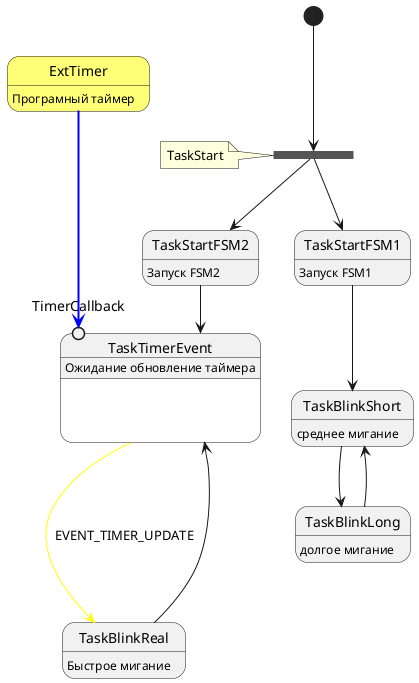

# FreeRtosUML Библиотека

## Описание

Это библиотека, которая позволяет создавать конечные автоматы на базе диаграмм UML, используя операционные системы реального времени и поддерживая возможности многопоточности.

## Установка и использование

Для начала использования библиотеки выполните следующие действия:

1. Скопируйте исходные файлы библиотеки в папку вашего проекта.
2. Настройте параметры в соответствии с требованиями вашего проекта:
   - `DELAY_QUEUE`: время ожидания передачи данных в переполненную очередь.
   - `NUM_EVENTS`: количество событий.
   - `NUM_STATES`: количество состояний.

## Зависимости и требования

Для использования этой библиотеки вам потребуется настроить ваш проект для работы с `cmsis_os` (например, инициализация в CubeIDE). Библиотека была протестирована на CMSIS v2.

Для корректной работы вашего проекта рекомендуется следовать предоставленному шаблону, описанному в файле `main.c`:
- Создайте перечисления состояний и внешних событий.
- Количество задач должно соответствовать количеству состояний, а количество очередей должно быть равно количеству состояний.
- Если вы используете статический стек, подберите размеры задач и очередей в зависимости от ваших потребностей.

## Примеры использования

В файле `main.c` представлены более подробные примеры использования. Ниже приведена UML-диаграмма, составленная с помощью PlantUML:



Затем, на основе этой диаграммы, мы настраиваем конечный автомат в функции задачи fTaskStart. Мы инициализируем его с параметрами, соответствующими диаграмме, добавляем состояния для работы в многопоточности и определяем переходы между ними. Пример кода:
```c
// В функции задачи fTaskStart инициализируем с параметрами, соответствующими диаграмме.
initializeTransitionEvent(transitionTable, NUM_STATES, NUM_EVENTS);
initializeTransitionEndState(transitionEndState, NUM_STATES);
initializeTransitionFork(transitionForkState, NUM_STATES, NUM_STATES);

// Добавляем состояния для работы в многопоточности.
addToTransitionFork(TaskStart, TaskStartFSM1);
addToTransitionFork(TaskStart, TaskStartFSM2);

// Добавляем переходы, которые должны произойти при завершении состояния.
addToTransitionEndState(TaskStartFSM1, TaskBlinkShort);
addToTransitionEndState(TaskBlinkShort, TaskBlinkLong);
addToTransitionEndState(TaskBlinkLong, TaskBlinkShort);
addToTransitionEndState(TaskStartFSM2, TaskTimerEvent);
addToTransitionEndState(TaskBlinkReal, TaskTimerEvent);

// Добавляем переход по событию.
addToTransitionEvent(TaskTimerEvent, TaskBlinkReal, EVENT_TIMER_UPDATE);

// Добавляем очереди для каждого состояния.
createStateQueueMapping(TaskStart, myQueue0Handle);
createStateQueueMapping(TaskStartFSM1, myQueue1Handle);
createStateQueueMapping(TaskStartFSM2, myQueue2Handle);
createStateQueueMapping(TaskBlinkShort, myQueue3Handle);
createStateQueueMapping(TaskBlinkLong, myQueue4Handle);
createStateQueueMapping(TaskBlinkReal, myQueue5Handle);
createStateQueueMapping(TaskTimerEvent, myQueue6Handle);

```
Затем мы определяем функции для каждого состояния, где мы ждем входа в состояние, обрабатываем события и отправляем новое состояние в очередь. Например:
```c
void fTaskTimerEvent(void *argument)
{
	State_t currentState = TaskTimerEvent;
	Event_t event = NUM_EVENTS; 
  	for(;;)
  	{
		waitForOwnState(&currentState);
		osTimerStart(TimerBlinkDelayHandle, pdMS_TO_TICKS(10000));
		waitForOwnEvent(currentState, &event);
		sendToTransitionEvent(TaskTimerEvent, event);
    	osDelay(1);
  	}
}

```
Инициализируем текущее состояние и определяем событие, которое будет обрабатываться. Затем в цикле ожидаем получения сообщения из соответствующей очереди задачи, что означает вход в это состояние. После выполнения всех действий ожидаем поступления в очередь внешнего события (при необходимости). Далее происходит обработка события и извлечение нового состояния, которое затем отправляется в соответствующую очередь для обработки нового состояния.

Например, вот функция для обратного вызова таймера:
```c
void CallbackTimerBlinkDelay(void *argument)
{
	MessageQueueEvent(TaskTimerEvent, EVENT_TIMER_UPDATE);
}

```
Этот пример иллюстрирует отправку события EVENT_TIMER_UPDATE в состояние TaskTimerEvent.


## Лицензия

Эта библиотека распространяется под лицензией MIT. Подробную информацию можно найти в файле `LICENSE`.

## Поддержка и обратная связь

Если у вас возникли вопросы или вам нужна помощь, пожалуйста, свяжитесь с разработчиком по адресу электронной почты: arruin1996@gmail.com. Мы готовы помочь вам с использованием и настройкой этой библиотеки.
