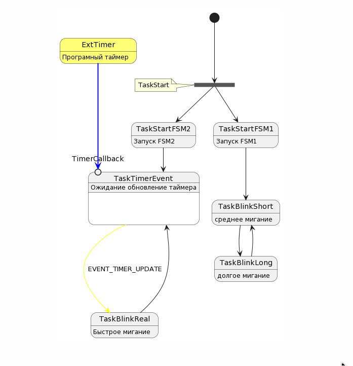
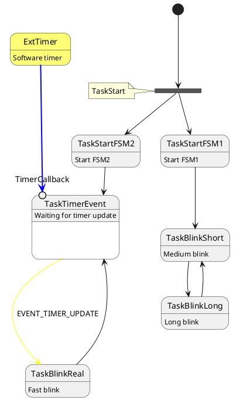
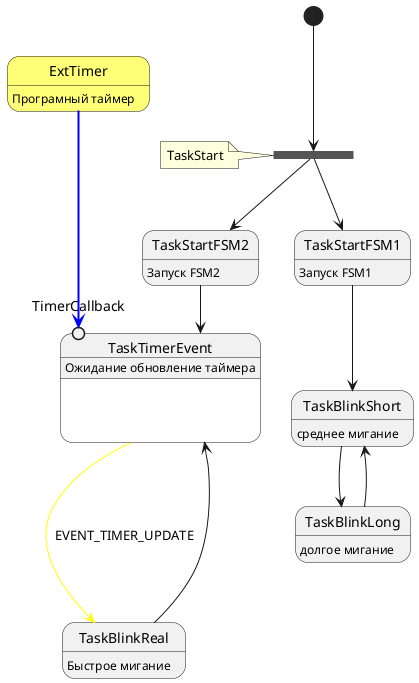

# FreeRtosUML Library

## Description

This is a library that allows you to create finite state machines based on UML diagrams, using real-time operating systems and supporting multithreading capabilities.

## Installation and Usage

To start using the library, follow these steps:

1. Copy the library's source files into your project folder.
2. Configure the parameters according to your project's requirements:
   - `DELAY_QUEUE`: the waiting time before data transmission to an overflowed queue.
   - `NUM_EVENTS`: the number of events.
   - `NUM_STATES`: the number of states.

## Dependencies and Requirements

To use this library, you will need to configure your project to work with `cmsis_os` (e.g., initialization in CubeIDE). The library has been tested on CMSIS v2.

For the correct operation of your project, it is recommended to follow the provided template described in the `main.c` file:

- Create state and external event enumerations.
- The number of tasks should match the number of states, and the number of queues should be equal to the number of states.
- If you use a static stack, adjust the sizes of tasks and queues according to your needs.

## Examples of Use

In the `main.c` file, more detailed examples of usage are provided. Below is a UML diagram created using PlantUML:




```c
Then, based on this diagram, we set up the finite state machine in the fTaskStart task function. We initialize it with parameters corresponding to the diagram, add states for multithreading, and define transitions between them. Example code:
// In the fTaskStart task function, initialize it with parameters corresponding to the diagram.
initializeTransitionEvent(transitionTable, NUM_STATES, NUM_EVENTS);
initializeTransitionEndState(transitionEndState, NUM_STATES);
initializeTransitionFork(transitionForkState, NUM_STATES, NUM_STATES);

// Add states for multithreading.
addToTransitionFork(TaskStart, TaskStartFSM1);
addToTransitionFork(TaskStart, TaskStartFSM2);

// Add transitions to occur upon state completion.
addToTransitionEndState(TaskStartFSM1, TaskBlinkShort);
addToTransitionEndState(TaskBlinkShort, TaskBlinkLong);
addToTransitionEndState(TaskBlinkLong, TaskBlinkShort);
addToTransitionEndState(TaskStartFSM2, TaskTimerEvent);
addToTransitionEndState(TaskBlinkReal, TaskTimerEvent);

// Add transitions by event.
addToTransitionEvent(TaskTimerEvent, TaskBlinkReal, EVENT_TIMER_UPDATE);

// Add queues for each state.
createStateQueueMapping(TaskStart, myQueue0Handle);
createStateQueueMapping(TaskStartFSM1, myQueue1Handle);
createStateQueueMapping(TaskStartFSM2, myQueue2Handle);
createStateQueueMapping(TaskBlinkShort, myQueue3Handle);
createStateQueueMapping(TaskBlinkLong, myQueue4Handle);
createStateQueueMapping(TaskBlinkReal, myQueue5Handle);
createStateQueueMapping(TaskTimerEvent, myQueue6Handle);
```
Finally, we define functions for each state, where we wait for entry into the state, process events, and send the new state to the queue. For example:
```c
void fTaskTimerEvent(void *argument)
{
	State_t currentState = TaskTimerEvent;
	Event_t event = NUM_EVENTS; 
  	for(;;)
  	{
		waitForOwnState(&currentState);
		osTimerStart(TimerBlinkDelayHandle, pdMS_TO_TICKS(10000));
		waitForOwnEvent(currentState, &event);
		sendToTransitionEvent(TaskTimerEvent, event);
    	osDelay(1);
  	}
}

```
Initialize the current state and define the event to be processed. Then, in a loop, wait for a message from the corresponding task queue, indicating entry into this state. After completing all actions, wait for an incoming external event queue (if necessary). Next, process the event and extract the new state, which is then sent to the corresponding queue for the new state to be processed.

For instance, here's a function for the timer callback:
```c
void CallbackTimerBlinkDelay(void *argument)
{
	MessageQueueEvent(TaskTimerEvent, EVENT_TIMER_UPDATE);
}

```

This example illustrates sending the EVENT_TIMER_UPDATE event to the TaskTimerEvent state.

##License
This library is distributed under the MIT license.

##Support and Feedback
If you have any questions or need assistance, please contact the developer via email: arruin1996@gmail.com. We are ready to help you with the usage and configuration of this library.
## Описание

Это библиотека, которая позволяет создавать конечные автоматы на базе диаграмм UML, используя операционные системы реального времени и поддерживая возможности многопоточности.

## Установка и использование

Для начала использования библиотеки выполните следующие действия:

1. Скопируйте исходные файлы библиотеки в папку вашего проекта.
2. Настройте параметры в соответствии с требованиями вашего проекта:
   - `DELAY_QUEUE`: время ожидания передачи данных в переполненную очередь.
   - `NUM_EVENTS`: количество событий.
   - `NUM_STATES`: количество состояний.

## Зависимости и требования

Для использования этой библиотеки вам потребуется настроить ваш проект для работы с `cmsis_os` (например, инициализация в CubeIDE). Библиотека была протестирована на CMSIS v2.

Для корректной работы вашего проекта рекомендуется следовать предоставленному шаблону, описанному в файле `main.c`:
- Создайте перечисления состояний и внешних событий.
- Количество задач должно соответствовать количеству состояний, а количество очередей должно быть равно количеству состояний.
- Если вы используете статический стек, подберите размеры задач и очередей в зависимости от ваших потребностей.

## Примеры использования

В файле `main.c` представлены более подробные примеры использования. Ниже приведена UML-диаграмма, составленная с помощью PlantUML:



Затем, на основе этой диаграммы, мы настраиваем конечный автомат в функции задачи fTaskStart. Мы инициализируем его с параметрами, соответствующими диаграмме, добавляем состояния для работы в многопоточности и определяем переходы между ними. Пример кода:
```c
// В функции задачи fTaskStart инициализируем с параметрами, соответствующими диаграмме.
initializeTransitionEvent(transitionTable, NUM_STATES, NUM_EVENTS);
initializeTransitionEndState(transitionEndState, NUM_STATES);
initializeTransitionFork(transitionForkState, NUM_STATES, NUM_STATES);

// Добавляем состояния для работы в многопоточности.
addToTransitionFork(TaskStart, TaskStartFSM1);
addToTransitionFork(TaskStart, TaskStartFSM2);

// Добавляем переходы, которые должны произойти при завершении состояния.
addToTransitionEndState(TaskStartFSM1, TaskBlinkShort);
addToTransitionEndState(TaskBlinkShort, TaskBlinkLong);
addToTransitionEndState(TaskBlinkLong, TaskBlinkShort);
addToTransitionEndState(TaskStartFSM2, TaskTimerEvent);
addToTransitionEndState(TaskBlinkReal, TaskTimerEvent);

// Добавляем переход по событию.
addToTransitionEvent(TaskTimerEvent, TaskBlinkReal, EVENT_TIMER_UPDATE);

// Добавляем очереди для каждого состояния.
createStateQueueMapping(TaskStart, myQueue0Handle);
createStateQueueMapping(TaskStartFSM1, myQueue1Handle);
createStateQueueMapping(TaskStartFSM2, myQueue2Handle);
createStateQueueMapping(TaskBlinkShort, myQueue3Handle);
createStateQueueMapping(TaskBlinkLong, myQueue4Handle);
createStateQueueMapping(TaskBlinkReal, myQueue5Handle);
createStateQueueMapping(TaskTimerEvent, myQueue6Handle);

```
Затем мы определяем функции для каждого состояния, где мы ждем входа в состояние, обрабатываем события и отправляем новое состояние в очередь. Например:
```c
void fTaskTimerEvent(void *argument)
{
	State_t currentState = TaskTimerEvent;
	Event_t event = NUM_EVENTS; 
  	for(;;)
  	{
		waitForOwnState(&currentState);
		osTimerStart(TimerBlinkDelayHandle, pdMS_TO_TICKS(10000));
		waitForOwnEvent(currentState, &event);
		sendToTransitionEvent(TaskTimerEvent, event);
    	osDelay(1);
  	}
}

```
Инициализируем текущее состояние и определяем событие, которое будет обрабатываться. Затем в цикле ожидаем получения сообщения из соответствующей очереди задачи, что означает вход в это состояние. После выполнения всех действий ожидаем поступления в очередь внешнего события (при необходимости). Далее происходит обработка события и извлечение нового состояния, которое затем отправляется в соответствующую очередь для обработки нового состояния.

Например, вот функция для обратного вызова таймера:
```c
void CallbackTimerBlinkDelay(void *argument)
{
	MessageQueueEvent(TaskTimerEvent, EVENT_TIMER_UPDATE);
}

```
Этот пример иллюстрирует отправку события EVENT_TIMER_UPDATE в состояние TaskTimerEvent.


## Лицензия

Эта библиотека распространяется под лицензией MIT. 

## Поддержка и обратная связь

Если у вас возникли вопросы или вам нужна помощь, пожалуйста, свяжитесь с разработчиком по адресу электронной почты: arruin1996@gmail.com. Мы готовы помочь вам с использованием и настройкой этой библиотеки.
